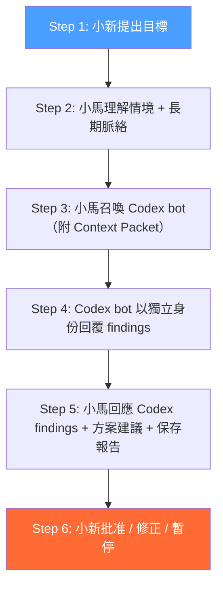
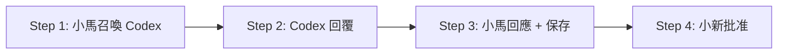
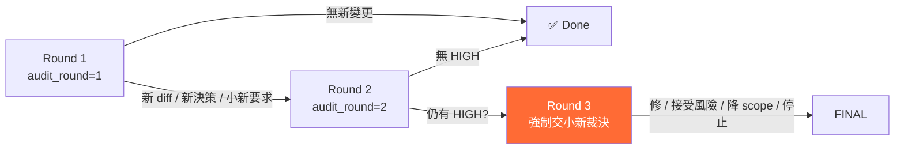

# War Room 工作流程正式規格

**版本**: v1 | **日期**: 2026-06-01 | **狀態**: Canonical Spec（合併 F1/F2/F3/F4）

**來源文件**:
- F1: `specs/references/xiaoma-private-war-room-workflow-v1.md`
- F2: `specs/research/war-room-conversation-protocol-v1.md`
- F3: `specs/research/war-room-conversation-protocol-v2.md`
- F4: `specs/reports/war-room-protocol-trial-plan-v1.md`

---

## 1. 角色定義表

### 1.1 角色身份與權責邊界

| 角色 | 身份 | 責任 | 權限邊界 | 不擁有 |
|:----:|:----:|:------|:---------|:--------|
| **👤 小新** | 唯一決策者 | 下達目標、批准/否決提案、決定路線、終止討論 | 可以批准 implement、可以 override Codex 建議、可以 override 小馬提案 | 技術細節（不必） |
| **🤖 小馬** | 營運官 + 脈絡提供者 | 整理需求、提供 context、召喚 Codex、分析結果、提案、**保存 Codex 輸出**、管理長期記憶 | 可以召喚 Codex、可以整理方案、可以保存紀錄、**不能替小新批准**、不能用拆任務繞過強制審查 | 最終批准、工程實作 |
| **🤖 Codex bot** | 被召喚式工程審查官 | 回應 audit command、回 text 審查結果、標示風險與位置 | **不能 implement、不能批准、不能自動發言、不能召喚任何人、不存檔** | 決策、實作（除非授權） |
| **🔧 OPC** (小馬內部) | 小馬內部研究與設計團隊 | 做 spec、方案對比、架構研究、產出設計分析 | 不對外對話；與小新無直接溝通路徑 | 決策、外部溝通 |
| **🗄️ Base** | 可靠事實資料庫 | 儲存結構化數據、提供事實查詢 | 僅作為資料來源，不參與討論 | 記憶、脈絡、建議 |

### 1.2 發言權限

```
群組訊息流：

小新 ──→ 所有角色（下達指令、批准、質疑）
小馬 ──→ 所有角色（含召喚 Codex bot + 保存報告 + 整理脈絡）
Codex bot ──→ 僅回應直接 /codex_audit 或 /codex_review command
             （不主動監聽任務、不自動審查、不自動觸發、不存檔）
OPC ──→ 不對外發言（產出經由小馬呈報）
Base ──→ 不對外部通訊（僅資料查詢）
```

### 1.3 核心鐵律

> **Codex bot 不得批准任何事項。Codex bot 不得 implement。Codex bot 不得自動觸發。**

| 原則 | 說明 |
|:-----|:------|
| 被動回應 | Codex bot 只在收到 `/codex_audit` 或 `/codex_review` 時回應 |
| 不主動 | 不監聽群組討論、不評論、不建議、不觸發 |
| 不召喚 | 不 tag 小新或小馬 |
| 不批准 | 回覆必須以「建議」或「發現」開頭，不包含「已批准」 |
| 不 implement | sandbox 永遠 read-only |
| 不存檔 | Codex bot 只回 text/summary，不寫檔案 |
| 報告由小馬保存 | Codex 的完整 stdout 由小馬保存到 `specs/reports/` 或小馬記憶 |

---

## 2. Private War Room Boundary

### 2.1 成員清單

Telegram 作戰室僅允許三位成員：

| 身份 | 說明 |
|:-----|:------|
| 小新 | 人類，唯一決策者 |
| 小馬 bot | AI 作戰副駕，Telegram bot |
| Codex bot | 被召喚式工程審查官，Telegram bot |

### 2.2 ACL 規則

| 規則 | 行為 |
|:-----|:------|
| 非白名單 user | → reject + audit log |
| 錯誤 chat/topic | → reject + audit log |
| 群組成員變更 | → SAFE_LOCKED 鎖定 |
| SAFE_LOCKED 狀態 | 僅允許 `status` / `help` 指令 |
| 轉發訊息（forwarded message） | → reject |
| Codex bot 不發送到其他 chat | 只回應原始頻道 |
| ACL fail-closed | 缺少配置不啟動，預設拒絕所有 |

### 2.3 雙向通訊架構

```
小馬 ──trigger.json──→ Codex bot
Codex bot ──reply.json──→ 小馬（小馬可讀取 ✅）
Codex bot ──HTTP API──→ Telegram 群組（小新可看到 ✅）
小馬 ──Telegram──→ 群組（小新可看到 ✅）
```

**說明**:
- 小馬透過 `trigger.json` 發出審查請求給 Codex bot
- Codex bot 透過 `reply.json` 回傳審查結果給小馬（機器對機器通道）
- Codex bot 同時透過 HTTP API 將結果發送到 Telegram 群組（小新可見）
- 小馬透過 Telegram 群組發送脈絡整理與提案（小新可見）
- **所有通訊最終呈現於 Telegram 群組，小新可完整追蹤**

---

## 3. 標準三方流程

### 3.1 完整流程（6 步驟）



**Step 1: 小新提出目標**
```
[小新]: 幫我看一下 subscription 功能的 schema 有沒有問題
```

**Step 2: 小馬整理需求與 context**
```
[小馬]: 了解，我先整理相關 context:
        - 相關 migration: 20260527170000_create_finance_subscriptions.sql
        - 相關 Edge Function: ai-process-subscriptions
        - 風險等級: 🟡 MED (money logic)
        我召喚 Codex 做 audit。
```

**Step 3: 小馬召喚 Codex bot（附 Context Packet）**
```
[小馬]: /codex_audit@XiaomaCodexBot task_id=sub-20260601 audit_round=1
        請審查 supabase/migrations/20260527170000_create_finance_subscriptions.sql
        和 supabase/functions/ai-process-subscriptions/index.ts
        檢查：schema 設計、RLS 覆蓋、SQL injection 風險、billing logic 正確性
```

**Step 4: Codex bot 回覆 text（不存檔）**
```
[Codex bot]: 📋 Codex Audit #abc123 ✅
             Issues requiring decision:
             1. [MED] RLS missing on subscription_events table
             2. [LOW] No index on user_id + status
             3. [INFO] billing_amount 無 CHECK constraint

             Risk: 🟡 MED
```

**Step 5: 小馬回應 Codex findings + 方案建議 + 保存報告**
```
[小馬]: Codex audit 結果分析:
        - Issue 1 (RLS)： ✅ 接受，需要補 migration
        - Issue 2 (index)： ✅ 接受，效能改善
        - Issue 3 (CHECK)： ⚠️ 可接受，應用層已有驗證
        📄 報告已保存: specs/reports/codex-audit-sub-20260601.md

        建議：補 RLS + index migration，約 1 小時
        是否需要小新批准修復？→ 等待決定
```

**Step 6: 小新批准 / 修正 / 暫停**
```
[小新]: 批准修 issue 1 和 2
```

### 3.2 簡化流程（低風險適用）

當任務風險為 LOW 且不涉及 schema/migration/權限/金流邏輯時，可使用 4 步驟簡化流程：



**適用條件**: 低風險 docs、純文字整理、日常建議、小馬內部記憶整理、一般回應

### 3.3 強制召喚 Codex 條件

以下情況**必須**召喚 Codex bot 進行審查：

| 類別 | 情境 | 風險 |
|:-----|:------|:----:|
| **Schema / Migration** | 任何新的 migration 或 schema 變更 | 🔴 HIGH |
| **金流邏輯** | budget / spending limit / subscription / payment / reconciliation | 🔴 HIGH |
| **權限安全** | Auth / RLS / GRANT / service role / JWT / ACL / secret | 🔴 HIGH |
| **多檔案改動** | 5+ source files 或跨前後端+Edge Function+DB 任兩層 | 🟡 MED |
| **P0/P1 功能** | 小新 roadmap 中的 P0/P1 功能 | 🟡 MED |
| **Production 操作** | deployment / cron / destructive SQL / data backfill | 🔴 HIGH |
| **Refactor** | 非純粹加法的程式改寫 | 🟡 MED |
| **小馬不確定** | 小馬對方案的正確性沒有把握（預設升級為需審查） | 🟡 MED |
| **小新要求** | 小新直接說「讓 Codex 看一下」 | 🔴 HIGH |

### 3.4 不必召喚 Codex 的條件

| 類別 | 情境 | 理由 |
|:-----|:------|:------|
| Typo / 純文字 | 修正錯字、文案調整 | 無 code 影響 |
| 純文字整理 | 文件排版、README 更新 | 無 code 影響 |
| 低風險 docs | 不影響程式邏輯的文件 | 無 code 影響 |
| 小馬內部記憶整理 | MEMORY.md 更新、checkpoint | 無 repo code 變更 |
| 日常建議 | 無 code/schema 影響的建議 | 低風險 |
| 一般回應 | 回覆小新問題、解釋既有程式 | 不需審查 |

> **不確定時預設召喚（安全優先）。**

---

## 4. Context Packet 格式

### 4.1 權威 Schema

> **採用 v2.0 結構化格式為基礎，回補 v1.1 關鍵欄位。**

```yaml
# ── 必填欄位 ──
task_id: "string"                    # 唯一任務 ID（防繞過兩輪限制）
audit_round: 1                       # 1 或 2（Round 2 需新 diff / 新決策）
parent_task: null                    # Round 2 時填 Round 1 的 task_id；Round 1 為 null
requester: "小馬"
review_type: "spec | diff | security | architecture"   # 審查類型

# ── 範圍 ──
base_ref: "main"                     # 比較基準分支
target_ref: "working tree"           # 目標分支或工作樹
changed_files_with_reason:           # 檔案清單 + 理由（結構化，非純陣列）
  - path: "supabase/migrations/20260527170000_create_finance_subscriptions.sql"
    reason: "新 subscription schema，需檢查 RLS 與 FK 設計"
  - path: "supabase/functions/ai-process-subscriptions/index.ts"
    reason: "金流處理邏輯"

out_of_scope:                        # ⭐ 回補自 F2 — 防止審查到不該碰的範圍
  - "現有 subscription 資料遷移"
  - "前端 UI 變更"

# ── 審查目標 ──
acceptance_criteria:                 # 驗收標準
  - "RLS 覆蓋所有新 table"
  - "billing_amount 有正數限制"
  - "無 SQL injection 路徑"

explicit_question: "這個 schema 設計有沒有安全或 money logic 風險？"  # ⭐ 回補自 F2

# ── 風險與脈絡 ──
risk_level: "HIGH | MED | LOW"
known_constraints:                   # Codex 必須遵守的限制
  - "read-only sandbox"
  - "not implement"
  - "two-round max"
  - "not commit"
  - "not read secrets"

# ── Round 2 專用 ──
prior_findings:                      # 前一輪 findings 的處理狀態
  - job_id: "abc123"
    status: "accepted | rejected | deferred"

# ── 測試證據 ──
test_evidence:
  - command: "npm test"
    result: "pass | fail | not_run"

# ── 決策點 ──
decision_required: true              # 此審查是否需要小新裁決
requested_decision_owner: "小新"     # 決策擁有者

# ── 選填欄位 ──
conversation_link: "message link or reference"  # 對話連結（追蹤用）
```

### 4.2 欄位總表

| 欄位 | 必填/選填 | Round 1 | Round 2 | 來源 |
|:-----|:---------:|:-------:|:-------:|:----:|
| `task_id` | **必填** | ✅ | ✅ | F1/F2/F3 |
| `audit_round` | **必填** | `1` | `2` | F1/F2/F3 |
| `parent_task` | 選填 | `null` | Round 1 ID | F3 ← 回補 F2 |
| `requester` | **必填** | ✅ | ✅ | F1/F2/F3 |
| `review_type` | **必填** | ✅ | ✅ | F3 |
| `base_ref` | 選填 | ✅ | ✅ | F3 |
| `target_ref` | 選填 | ✅ | ✅ | F3 |
| `changed_files_with_reason` | **必填** | ✅ | ✅ | F3 |
| `out_of_scope` | 選填 | ✅ | ✅ | ⭐ 回補 F2 |
| `acceptance_criteria` | **必填** | ✅ | ✅ | F1/F2/F3 |
| `explicit_question` | **必填** | ✅ | ✅ | ⭐ 回補 F2 |
| `risk_level` | **必填** | ✅ | ✅ | F1/F2/F3 |
| `known_constraints` | 選填 | ✅ | ✅ | F3 |
| `prior_findings` | 選填 | ❌ | ✅ | F3 |
| `test_evidence` | 選填 | ✅ | ✅ | F3 |
| `decision_required` | 選填 | ✅ | ✅ | F3 |
| `requested_decision_owner` | 選填 | ✅ | ✅ | F3 |
| `conversation_link` | 選填 | ✅ | ✅ | ⭐ 回補 F2 |

### 4.3 召喚格式（Telegram Command）

```
/codex_audit@XiaomaCodexBot task_id={id} audit_round={1|2}
{task goal or explicit question}
{branch / diff scope / changed files}
{risk level}
{acceptance criteria}
```

也可使用別名：
```
/codex_review@XiaomaCodexBot task_id={id} audit_round={1|2}
```

---

## 5. Codex Bot Audit-Only 規則

### 5.1 Allowlist（允許操作）

| 指令 | 說明 |
|:-----|:------|
| `/codex_help` | 指令參考 |
| `/codex_status` | 查 job 狀態 |
| `/codex_audit` | 執行程式碼審查（read-only） |
| `/codex_review` | `/codex_audit` 別名 |
| `/codex_cancel` | 取消進行中 job |
| read-only sandbox | 唯讀審查 |
| redacted Telegram summary | 遮罩後回覆 |
| report text | 回傳給小馬 |

### 5.2 Blocklist（禁止操作）

| 操作 | 原因 |
|:-----|:------|
| implement mode | 不允許實作 |
| workspace-write | 不允許寫入工作區 |
| danger-full-access | 不允許完全存取 |
| 修改 source code | 超出審查範圍 |
| 修改 schema / migration | 資料庫變更需要小新批准 |
| git commit / push | 版本控制操作 |
| 讀取 .env / token / credentials | 敏感資料 |
| 檔案上傳 / 下載 | 超出範圍 |
| 語音轉寫 | 超出範圍 |
| 模型切換 | 超出範圍 |
| 回覆非作戰室 | 違反邊界 |
| 自動觸發審查 | 違反被動原則 |
| 產生 implementation code / patch | 超出審查範圍 |
| 寫入任何檔案 | 僅回 text |

### 5.3 Codex 回覆格式

#### 標準回覆範本

```
📋 Codex Audit #{job_id} ✅/⚠️/❌

結論: Go / No-Go / Go with fixes

Issues requiring decision:
1. 🔴 [LEVEL] title
   • 位置: file:path:line
   • 風險說明
2. 🟡 [LEVEL] title
   • 位置: file:path:line
   • 風險說明

Risk Level: 🔴 HIGH / 🟡 MED / 🟢 LOW

Suggested next step:
- 小馬分析 issues
- 小新決定是否批准修復
- 小馬保存審查紀錄

*此為自動 code review 結果，不構成最終決策。*
```

#### Finding 等級表

| 等級 | 意義 | 說明 |
|:----:|:------|:------|
| 🔴 **HIGH** | 必須處理才能合併 | 安全漏洞、金流錯誤、資料遺失風險 |
| 🟡 **MED** | 建議處理，可暫緩 | 效能問題、設計不佳、程式碼氣味 |
| 🟢 **LOW** | 資訊性，可忽略 | 風格問題、小建議 |
| ℹ️ **INFO** | 僅供參考 | 觀察、替代方案建議 |

#### Codex 回覆中不允許的內容

- ❌ 不得包含「已批准」或「我批准」
- ❌ 不得包含 implementation code / patch
- ❌ 不得包含 git commit 指令
- ❌ 不得包含 raw secret / token / key
- ❌ 不得包含完整 `/home/janzongxin` 路徑
- ❌ 不得包含實作方案（只指出風險與位置）

---

## 6. 防 Loop 機制

### 6.1 兩輪限制



| 輪次 | 限制 | 觸發條件 |
|:----:|:-----|:---------|
| **Round 1** | 標準審查 | 小馬召喚（附 Context Packet） |
| **Round 2** | 需有新 diff / 新決策 / 小新要求 | 小馬可召喚，但需有理由 |
| **Round 3** | **強制交小新裁決**，小馬不得再召喚 | Round 2 仍有 HIGH finding 或意見分歧 |

### 6.2 防 Loop 規則表

| 規則 | 說明 |
|:-----|:------|
| 同一 task 最多兩輪 audit | Round 3 強制交小新裁決 |
| Round 2 觸發條件 | 需有新 diff、新決策或小新要求 |
| `parent_task` 機制 | 防 `task_id` 繞過兩輪限制（Round 2 需填 Round 1 ID） |
| Round 2 仍有 HIGH | 小新選擇：修 / 接受風險 / 降 scope / 停止 |
| Codex bot 不得自動觸發 | Codex bot 只能回應 command，不主動監聽 |
| 小馬不得無限重跑 audit | 同一 task_id 最多兩輪 |
| 意見分歧交小新裁決 | Codex vs 小馬 → 小新決定 |
| 已完成任務不得重審 | 除非小新明確要求 |

### 6.3 防 Loop 示意

```yaml
# Round 1 — 正常審查
task_id: "sub-20260601"
parent_task: null
audit_round: 1

# Round 2 — 需有理由
task_id: "sub-20260601"
parent_task: "previous-job-id"       # 必須填寫
audit_round: 2

# 禁止：新 task_id 繞過
# task_id: "sub-20260601-v2" ← 小馬不得用拆任務方式繞過
```

---

## 7. 安全閘門

**4 層防護架構**，確保 Codex bot 在嚴格邊界內運作：

### L1 — Command Allowlist（指令白名單）

只允許以下指令通過：
- `/codex_audit`
- `/codex_review`
- `/codex_status`
- `/codex_help`
- `/codex_cancel`

所有其他指令 → 拒絕 + audit log。

### L2 — Intent Gate（意圖閘門）

阻擋包含以下意圖的操作：
- `implement`
- `edit` / `write` / `modify`
- `commit` / `push`
- `deploy`
- `delete` / `drop`
- `read secret` / `read env`
- 任何引導 Codex bot 脫離唯讀審查的意圖

### L3 — Path Denylist（路徑黑名單）

阻擋 Codex bot 讀取以下路徑：
- `.env` / `.key`
- `credential` / `credentials`
- `token` / `tokens`
- `secret` / `secrets`
- `password` / `passwd`
- 任何包含敏感關鍵字的路徑

### L4 — Output Redaction（輸出遮罩）

| 類型 | 處理方式 |
|:-----|:---------|
| 疑似 secret / token / key | 遮罩為 `***REDACTED***` |
| 完整 `/home/janzongxin` 路徑 | 遮罩為 `[USER_HOME]` |
| API key pattern | 遮罩 |
| JWT / session token | 遮罩 |
| **高 confidence pattern** | 整份回覆 quarantine（不發送到 Telegram） |

### 安全閘門總結

```
L1 指令白名單 ─→ L2 意圖閘門 ─→ L3 路徑黑名單 ─→ L4 輸出遮罩
    │               │               │               │
    ▼               ▼               ▼               ▼
  通過指令      擋危險意圖      擋敏感路徑      遮罩敏感輸出
```

---

## 8. 小新批准點列表

以下事項**必須**經小新明確批准：

| # | 事項 | 風險 | 說明 |
|:-:|:-----|:----:|:------|
| 1 | **Phase transition**（Phase 1B → 1C） | 🔴 HIGH | 階段轉換需確認準備就緒 |
| 2 | **Codex bot 權限變更** | 🔴 HIGH | 擴大權限需審慎評估 |
| 3 | **新長期服務上線** | 🔴 HIGH | 新增服務需驗收 |
| 4 | **Schema / migration 變更** | 🔴 HIGH | 資料庫變更需批准 |
| 5 | **Production 操作** | 🔴 HIGH | deployment / cron / destructive SQL |
| 6 | **風險接受（High finding 不修）** | 🔴 HIGH | 接受風險需小新知曉 |
| 7 | **工作流協議變更** | 🔴 HIGH | 本文件的任何修改 |
| 8 | **Round 3 裁決** | 🔴 HIGH | 兩輪後仍有 HIGH finding |
| 9 | **修復方案批准** | 🟡 MED | 小馬提出的修復方案 |
| 10 | **Codex vs 小馬意見分歧** | 🟡 MED | 爭議需小新裁決 |
| 11 | **試跑驗收** | 🟢 LOW | 試跑結果的最終確認 |

### 小新批准模板

```
小新，請批准 / 修正 / 暫停：

[ ] 批准 — 按上述方向進行
[ ] 修正 — 需要調整以下項目：...
[ ] 暫停 — 暫不推進
```

---

## 9. 小馬回應義務

### 9.1 回應範本

```
📋 Codex Audit #{job_id} 分析

Codex findings 回應：

✅ 接受:
  • Finding 1: (接受理由)
  • Finding 2: (接受理由)

❌ 不接受:
  • Finding 3: (不接受理由，例如「應用層已有驗證」)

建議方案：
1. 補 migration xxx（預計 30 分鐘）
2. 加 index（預計 10 分鐘）

對小新的影響：
- 如果要修：約 1 小時
- 如果暫緩：不影響上線

📄 報告已保存: specs/reports/codex-audit-{task_id}.md

下一個批准點：
小新是否批准上述修復方案？
```

### 9.2 禁止行為

| 禁止 | 說明 |
|:-----|:------|
| ❌ 不得跳過 Codex issues 不回應 | 每個 finding 都要有回應 |
| ❌ 不得擅自替小新批准修復 | 最終決策權在小新 |
| ❌ 不得修改 Codex audit 結果 | 保持審查原始內容 |
| ❌ 不得「已讀不回」 | 必須明確回應每一 finding |

### 9.3 產出與保存責任

| 產出 | 誰負責 | 儲存位置 |
|:-----|:------|:---------|
| Codex 審查 text | Codex bot → Telegram | 僅 Telegram 訊息 |
| Codex 完整 stdout | **小馬 capture** | `specs/reports/codex-audit-{task_id}.md` |
| 小馬摘要與分析 | **小馬** | Telegram + `specs/reports/` |
| 重要決策 | **小馬** | `specs/decisions/ADR-{number}.md` |
| 小馬記憶更新 | **小馬** | MEMORY.md + MemPalace |

> **關鍵規則**: Codex bot 不寫任何檔案。小馬保存所有審查紀錄。
> ❌ 敏感資料不寫入 report（token / API key / password）
> ❌ 不在 report 中包含完整 `/home/janzongxin` 路徑

---

## 10. 試跑計畫摘要

### 10.1 試跑任務

**任務**: Detabase Dashboard 資訊架構審查
**風險等級**: 🟢 LOW（純架構審查，無實作、無 schema 變更、無 migration）
**目標**: 驗證小新 → 小馬 → Codex bot → 小馬 → 小新的完整三方協作流程

### 10.2 選擇理由

| 評估項 | 結果 |
|:-------|:-----|
| 需改 code？ | ❌ 否，純審查 |
| 需改 schema？ | ❌ 否 |
| 需改 migration？ | ❌ 否 |
| 需改 token / ACL？ | ❌ 否 |
| 需改 systemd？ | ❌ 否 |
| 需新增 service？ | ❌ 否 |
| 需 commit / push？ | ❌ 否 |
| 風險等級 | 🟢 LOW |
| 小新需批准 | ✅ 是（最終驗收） |

### 10.3 試跑 Context Packet 範例

```yaml
task_id: "dash-ia-review-v1"
audit_round: 1
parent_task: null
requester: "小馬"
review_type: "architecture"
base_ref: "main"
target_ref: "working tree"
changed_files_with_reason:
  - path: "apps/web/app/dashboard/page.tsx"
    reason: "Dashboard 主頁面 — 審查 IA 結構"
  - path: "apps/web/app/dashboard/hooks/useDashboard.ts"
    reason: "資料流管理 — 審查 hook 設計"
  - path: "specs/references/detabase-gas-gap-analysis.md"
    reason: "需求差距分析 — 評估 IA 覆蓋率"
out_of_scope:
  - "任何程式碼變更"
  - "任何 schema 變更"
acceptance_criteria:
  - "IA 涵蓋目前現有功能（P0-3、P0-4、P1）"
  - "MVP scope 不超出 2 週開發"
  - "優先補 GAS 差距（決策面板）"
  - "保留 mobile-first 設計"
explicit_question: "這個 Dashboard IA 設計有沒有結構性問題？"
risk_level: "LOW"
known_constraints:
  - "read-only sandbox"
  - "not implement"
  - "not approve"
  - "not write files"
decision_required: true
requested_decision_owner: "小新"
```

### 10.4 試跑驗收標準

| # | 標準 | 檢查方式 |
|:-:|:-----|:---------|
| 1 | 完整跑完小馬 → Codex bot → 小馬 → 小新 | 流程紀錄 |
| 2 | 無 loop（不超過 2 輪 audit） | job log |
| 3 | Codex bot 沒有 implement | job 記錄 |
| 4 | Codex bot 沒有要求改 code | 回覆內容 |
| 5 | `git diff --stat` 保持空 | terminal 檢查 |
| 6 | 報告無敏感資料 | 人工檢查 |
| 7 | 小馬保存對話摘要 | `specs/reports/` |
| 8 | Codex 只回 text、不寫檔案 | 確認 report 由小馬寫入 |
| 9 | Sandbox 維持 read-only | `journalctl` 確認 flag |
| 10 | 無 workspace-write / danger-full-access | 確認無相關 flag 記錄 |

### 10.5 試跑禁止事項

- ❌ 不改任何 source code
- ❌ 不改 schema / migration
- ❌ 不改 bot token / ACL / systemd
- ❌ 不改 Codex bot code
- ❌ 不新增 service
- ❌ 不 git commit / push
- ❌ 不 implement mode
- ❌ 不 workspace-write
- ❌ 不 danger-full-access

---

## 附錄 A：版本資訊與變更記錄

### A.1 版本歷史

| 版本 | 日期 | 作者 | 變更說明 |
|:----:|:----:|:-----|:---------|
| v1 | 2026-06-01 | 戰術架構官 | Canonical Spec 初版 — 合併 F1/F2/F3/F4，解決 7 項不一致 |

### A.2 不一致解決記錄

| # | 不一致 | 嚴重度 | 解決方式 | 決策理由 |
|:-:|:-------|:------:|:---------|:---------|
| 1 | Context Packet 三版本不相容 | 🔴 HIGH | 採用 F3 v2.0 結構化格式為基礎 + 回補 F2 的 `out_of_scope`、`explicit_question`、`conversation_link` | v2.0 結構化程度最高（含 `changed_files_with_reason`、`prior_findings`），回補確保功能完整 |
| 2 | Codex 回覆格式不一致 | 🟡 MED | 保留 emoji（F2 風格） | 可讀性較高，Telegram 環境友善 |
| 3 | 小馬回應模板不一致 | 🟡 MED | 採用 F2 進階版（含時間估計 + 影響評估） | 資訊最完整 |
| 4 | OPC 角色模糊 | 🟢 LOW | 保留 OPC 角色，明確定義為「小馬內部研究與設計團隊，不對外對話」 | OPC 是架構重要概念 |
| 5 | Base 角色缺失 | 🟢 LOW | 保留在角色定義表，不重複 Detabase 架構文件 | 保持本 spec 自給自足 |
| 6 | 強制召喚條件不同 | 🟢 LOW | 採用 F3 較寬範圍 + 保留 F2 原始類別 | 安全優先，覆蓋最完整 |
| 7 | 安全閘門僅存於 F3 | 🟢 LOW | 獨立章節收納 L1-L4 四層防護 | 獨立章節利於維護 |

### A.3 參考文件

| 文件 | 路徑 | 用途 |
|:-----|:-----|:------|
| Workflow Formalization v1 | `specs/references/xiaoma-private-war-room-workflow-v1.md` | 基底規格（角色、邊界、流程） |
| Phase 1B Protocol v1.1 | `specs/research/war-room-conversation-protocol-v1.md` | 詳細三方協議設計 |
| Protocol Discussion v2.0 | `specs/research/war-room-conversation-protocol-v2.md` | 雙向討論產出（安全閘門、通訊架構） |
| Trial Plan v1 | `specs/reports/war-room-protocol-trial-plan-v1.md` | 試跑計畫 |
| 整合分析報告 | `consolidation-analysis.md` | 情報官的不一致分析（T1 產出） |

### A.4 待小新驗收項目

- [ ] 角色邊界是否接受
- [ ] 強制審查條件門檻是否合理
- [ ] Context Packet 格式（v2.0 + 回補 F2）是否完整
- [ ] 防 Loop 機制是否足夠
- [ ] 安全閘門 L1-L4 強度是否滿意
- [ ] 雙向通訊架構是否可用
- [ ] 小新批准點列表是否完整
- [ ] 是否批准進 Phase 1B 試跑
- [ ] OPC 角色保留為「小馬內部團隊」是否接受
- [ ] Codex 回覆格式保留 emoji 是否接受

---

*本文件由戰術架構官於 WR-01 T2 期間產出，基於情報官 T1 整合分析 + 4 份原始文件的逐行交叉比對。*
